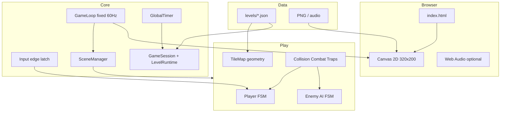
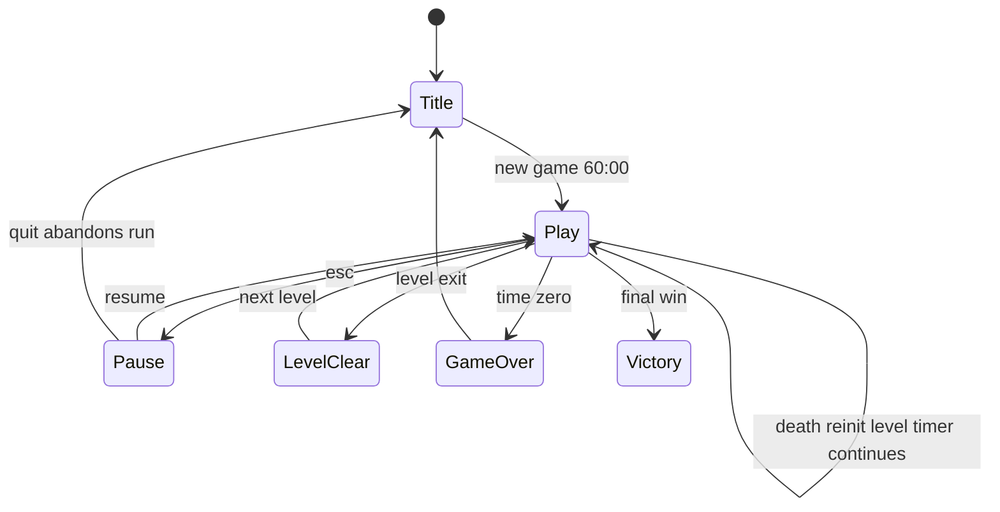
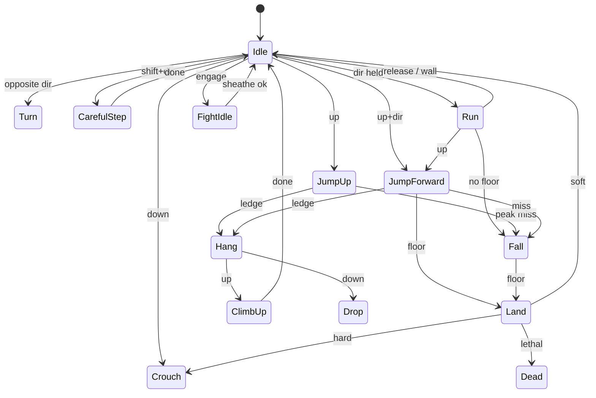
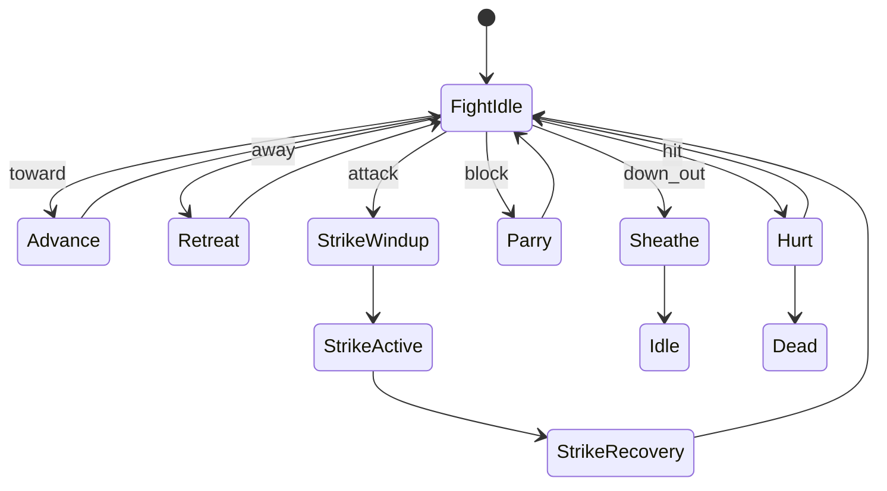

# Design Document: Grok Prince (original cinematic platformer)

> **Branding note (updated):** Public product name is **Grok Prince**. Frame inspiration as **multiple** classics (Castlevania, Metroid/Metroidvania, Prince of Persia–era cinematic platforming, late-80s dungeon-adventure games)—not a single-franchise homage or remake. All assets original. Prefer AGENTS.md / README for current positioning.

| Field | Value |
|-------|--------|
| **Title** | Browser-Playable 1989-Style Cinematic Platformer |
| **Author** | TBD (software design) |
| **Date** | 2026-07-12 |
| **Status** | Approved + product decisions locked (rev 2.2) |
| **Workspace** | `/Users/luissanchez/Documents/repos/grok-prince` |
| **Working product name** | **Grok Prince** (original; multi-franchise inspiration — see branding note) |
| **Canonical stage count** | **12** primary levels in vision; **MVP ships Level 1 only** |
| **Audio** | Silent MVP (no SFX/music) |
| **Difficulty** | Classic only — single difficulty, no assists |

---

## Overview

This project builds a **deployable, browser-playable 2D cinematic platformer** with sword combat, trap-filled multi-room levels, life pips, and a shared hourglass timer. Inspiration is **plural**: Castlevania-like duels and tension, Metroid/Metroidvania room graphs, Prince of Persia–era careful platforming and timed sword fights, and similar dungeon-adventure design—not a recreation of any single commercial title. This document defines stack, architecture, data formats, session/death rules, combat and movement contracts, MVP scope, legal constraints, and an incremental PR plan.

**Recommended stack:** **vanilla JavaScript (ES modules) + HTML5 Canvas 2D**, optional Vite for DX, **no backend** for MVP. All art and audio must be **original** (or clearly licensed)—never ripped from commercial releases, and **never traced/rotoscoped from commercial video frames**. Product framing: **original game with multi-franchise inspirational roots**, not an official product or clone.

**Revision 2.1** (after re-review) fixes residual internal inconsistencies (branding PR#, death health formula, plate mode ownership, hold-plate MVP room constraint, sheathe exit, life potion rule, stale PR gate). **Revision 2** closed implementability gaps: session/death policy, kinematic vs dynamic motion per state, combat numeric contracts, entity-first level wiring, locked framebuffer/HUD, room transition rules, Level 1 design target, animation clip schema, and reshuffled PR plan.

---

## Background & Motivation

### Why this project

Cinematic platformers of the late 1980s prioritized **weighty, animation-driven movement** and **room-scale puzzle combat** over modern coyote-time fluidity. A browser recreation makes that experience one-click accessible (GitHub Pages / Netlify / Vercel) for learning, portfolio, and nostalgia—while staying legally clean by authoring new assets.

### Current state

- Empty git workspace; no engine, assets, or levels yet (directory exists, no project files).
- Motion/combat references: public longplays and design patterns from several 80s–90s platformers (Castlevania, Metroid-class exploration, Prince of Persia–era cinematic platformers)—use as feel references only; redraw everything from scratch.
- Classic design facts used as targets: multi-stage castle run (**12 stages** in the classic 1989 design); Level 1 unarmed dungeon → find sword; guards and specialty foes; spikes, chompers, loose floors, gates, pressure plates, potions; health as red triangle pips (start with 3); sword duel model rather than projectiles; death restarts the current level while the global timer continues; only time expiry permanently loses the full run.

### Pain points to solve by design

| Pain | Design response |
|------|-----------------|
| "Floaty" modern platformer feel | Discrete action state machine + per-state kinematic/dynamic motion contract |
| Asset copyright risk | Original-inspired pixel art; no commercial files; no video-frame tracing |
| Scope explosion (12 levels × rooms × enemies) | Phased MVP: Level 1 complete + data-driven levels thereafter |
| Combat unfairness / obscurity | Explicit combat dual-FSM + numeric ranges/windows + tiered AI |
| Web performance / scaling | Locked 320×200 framebuffer + nearest-neighbor integer scale |
| Ambiguous death/save rules | Authoritative session policy table (K13) |

### Fidelity note on level count

The classic 1989 game is **12 stages** in one timed session. This design **locks canonical count to 12** in `manifest.json` comments and product copy. Extra JSON files may exist for experiments; do not brand the product as "13 levels" unless product reopens that decision.

---

## Goals & Non-Goals

### Goals

1. **Faithful systems** (full product vision): run / careful step / jump / hang / climb / crouch / fall damage; sword combat; traps; potions; multi-screen rooms; global 60-minute clock. See **Scope matrix** for MVP vs later phases.
2. **Playable early**: Level 1 end-to-end within early PRs, under classic death/timer rules.
3. **Static deploy**: zero server dependency for core play.
4. **Original-inspired presentation**: limited dungeon palette, large character sprites, life triangles, classic HUD timer.
5. **Maintainable architecture**: ES modules, pure logic separable from rendering for unit tests from the first physics PR.
6. **Keyboard-first controls** matching classic intent (arrows + Shift + sword keys).

### Non-Goals (v1 / MVP)

- Not an official product or asset reimplementation of any referenced franchise (Castlevania, Metroid, Prince of Persia, cinematic platformers, etc.).
- Not 3D, not mobile-first (touch optional later).
- Not multiplayer, not online leaderboards.
- Not perfect frame-accurate DOS emulation.
- Not full audio fidelity in MVP (silent or minimal SFX).
- **No mid-level checkpoints** (classic continuous pressure).
- **No mid-run save / resume**; no level-select unlock progression in classic mode.
- Not shipping commercial IP assets; not tracing commercial video frames for sprites.
- Not float potion / advanced mid-air movement variants in MVP.

---

## Key Decisions

| # | Decision | Rationale |
|---|----------|-----------|
| K1 | **Stack: Vanilla JS + HTML5 Canvas 2D + ES modules** | Full control over fixed timestep, pixel scaling, animation; static-host friendly; optional Vite without coupling logic to a framework. |
| K2 | **Optional Vite; required local static server for dev** | ES modules do not load from `file://`. README + `npm` script must serve over HTTP (Vite or `npx serve`). |
| K3 | **Fixed 60 Hz sim; snap poses (no render interpolation in MVP)** | Deterministic state; combat windows in ticks; classic feel via anim sub-rate, not 12 Hz sim. |
| K4 | **Player action FSM with per-state motion mode** | Pose-driven identity; explicit kinematic vs dynamic table prevents floaty hybrids. |
| K5 | **Framebuffer 320×200; playfield 320×192; HUD 8px top band** | Consistent art/camera/collision; 10×6 tiles × 32px playfield. |
| K6 | **JSON level + room graph** | Content without code; 12-level manifest. |
| K7 | **Original-inspired assets only** | Legal safety; reference timing/pose from longplay, redraw from scratch. |
| K8 | **MVP = engine + Level 1 complete** | Remaining levels are content after engine freeze. |
| K9 | **No backend; localStorage = settings (+ optional bestTime after victory)** | Classic run always starts Level 1 + 60:00; no unlock map for MVP. |
| K10 | **Combat gated on sword flag** | Unarmed enemy strike hitbox overlap = death. |
| K11 | **Branding: "Grok Prince"** | Original title; multi-franchise inspiration; multi-game disclaimer required. |
| K12 | **Phaser/Pixi deferred** | Explicit loop/collision for fidelity. |
| K13 | **Classic session/death policy (authoritative)** | Death → full level re-init from JSON; timer continues; no mid-level checkpoints. |
| K14 | **Entity-first interactives** | Tiles = static geometry (+ optional deco/climb wall); gates/plates/hazards/loot/enemies/exits = entities only. |
| K15 | **Top-level `links[]` is sole plate↔gate wiring + mode/action** | Entities hold `id` only; `mode`/`action` on links only; no `plate.mode` or `plate.links`. |
| K16 | **Combat constants live in `config.js`** | Numeric engage/strike/parry defaults; tunable without code archaeology. |
| K17 | **Debug overlay before combat PR** | Hitboxes/state/timer mandatory for tuning. |
| K18 | **Test harness from first physics PR** | Pure functions + at least one unit test when collision/FSM lands. |

---

## Scope Matrix

| Feature | MVP | Phase 2 | Phase 3 | Phase 4 |
|---------|-----|---------|---------|---------|
| Canvas boot, fixed loop, scenes, input | ✓ | | | |
| JSON rooms, solid tiles, horizontal room exits | ✓ | | | |
| Run / idle / turn | ✓ | | | |
| Jump / fall / fall damage | ✓ | | | |
| Careful step / crouch | ✓ | | | |
| Hang / climb | ✓ (required for Level 1 feel) | polish | | |
| Vertical room exits | ✓ if Level 1 needs them | | | |
| Sword pickup, 3 life pips, 60:00 timer | ✓ | | | |
| Death → level restart (timer continues) | ✓ | | | |
| Plate / gate / spikes / loose floor | ✓ | | | |
| Chomper | ✓ (simple duty cycle) | | | |
| Potion life + poison | ✓ | | | |
| Potion float | | ✓ | | |
| Combat tier 0–1 (weak guard) | ✓ | | | |
| Combat tier 2 (standard guard) | | ✓ | | |
| Fat guard / skeleton / boss | | | ✓ | |
| Shadow doppelganger | | | design spike / optional | |
| Levels 2–12 content | | sample L2 | full | |
| Original art pass | placeholders MVP; art PR parallel | polish | | |
| SFX / music | optional silent | ✓ SFX | music | |
| Practice / assist flags | optional late MVP | ✓ | | |
| Touch controls / level select mode | | | | ✓ |
| Tiled editor pipeline | hand JSON | optional Tiled | | |

**Product v1** = MVP (Level 1 shippable) unless product explicitly expands. Full 12-level game is **content roadmap**, not the first ship gate.

---

## Session & Death Policy (K13)

Authoritative client session model for **classic mode** (default, only mode in MVP unless assists added later).

### GameSession fields

```js
GameSession {
  timeLeftSec: number,      // starts 3600; never increases
  health: number,           // current pips
  maxHealth: number,        // starts 3; may grow if life potion expands max (MVP: life restores/adds with cap 10)
  hasSword: boolean,        // false at new game; set by sword entity once per level-run until level re-init
  levelId: string,
  roomId: string,
  // LevelRuntime: map of entityId → runtime state (dead, gate open, potion taken, loose collapsed)
}
```

### Event table

| Event | `timeLeft` | `health` | `maxHealth` | `hasSword` | Room / entity state | Level progress |
|-------|------------|----------|-------------|------------|---------------------|----------------|
| **New game from title** | `3600` | `3` | `3` | `false` | Load `level01` fresh from JSON | Start `level01` |
| **Death → restart level** | **continue** (do not reset) | **`health = levelEntryHealth`** (snapshot taken on level entry; MVP Level 1 entry is always 3) | keep session `maxHealth` | **Reset to level-initial** (from level JSON / start rules; Level 1 = `false` until sword re-picked) | **Full re-spawn** from level JSON (gates closed default, enemies alive, potions present, loose floors restored) | Stay on same `levelId` |
| **Level clear** | **continue** | **keep** current health (no auto full refill) | keep | **keep** | Discard current level runtime; load next level JSON fresh | Advance `manifest` |
| **Time zero** | freeze at 0 | — | — | — | `GameOverScene` (time up) | Run lost; new game only |
| **Quit to title** | abandon | abandon | abandon | abandon | discard | Timed run abandoned |
| **Pause** | freeze countdown | — | — | — | freeze sim | — |
| **Practice mode** (optional assist) | frozen or hidden | per classic restart rules | — | — | same | not default |

\* **Start-of-level health snapshot (authoritative)**: when entering a level (new game or after level clear), store `levelEntryHealth = health` and `levelEntryMax = maxHealth`. On death restart, set **`health = levelEntryHealth` only** — do **not** recompute as `min(3, maxHealth)`. Cross-level example: enter Level 2 with 2 pips → death on L2 restores 2, not 3. Potion-expanded `maxHealth` is kept on the session; death does not shrink `maxHealth`. **MVP Level 1**: entry health is always 3; sword always starts false.

### Explicit rules

1. **MVP has no mid-level checkpoints.**
2. **No mid-run save/resume.** localStorage does not store room position or entity runtime.
3. Classic run is always **full restart from Level 1 + 60:00** when starting from title.
4. Death is **not** game over unless time is already 0 or product later adds "lives" (not classic; do not add for MVP).
5. Only **time expiry** permanently loses the run (plus quit).

---

## Proposed Design

### 1. Stack choice and trade-offs

#### Recommendation: **Vanilla JS + Canvas 2D**

| Approach | Pros | Cons | Verdict |
|----------|------|------|---------|
| **Vanilla Canvas 2D** | Tiny, transparent loop, easy static host, full control | More plumbing | **Choose** |
| Phaser 3 | Scenes, loaders | Arcade physics fights action-FSM; heavier | Reject core |
| PixiJS | Fast WebGL | Still write gameplay; overkill for 320×200 | Reject MVP |
| WebGL raw | Max performance | Unnecessary | Reject |
| CSS/DOM sprites | Easy layout | Poor for collision + many tiles | Reject |
| DOSBox-wasm + original game | Perfect fidelity | Legal distribution of game files | Out of scope |

**Runtime**: evergreen browsers, ES2020+ modules. **Dev**: never rely on `file://`—use Vite or static server.

**Project layout (proposed)**

```text
prince/
├── index.html
├── package.json              # scripts: dev (vite|serve), test, build
├── vite.config.js            # optional
├── public/assets/...
├── src/
│   ├── main.js
│   ├── config.js             # resolution, motion, combat constants, flags
│   ├── core/                 # gameLoop, input, time, session
│   ├── scenes/
│   ├── entities/
│   ├── systems/              # collision, physics, combat, traps, animation
│   ├── level/                # LevelLoader, Room, TileMap, LevelRuntime
│   ├── data/levels/          # level01.json, manifest.json
│   ├── render/               # Renderer, Camera, Hud, DebugOverlay
│   └── audio/                # optional
├── tests/
└── docs/
```

### 2. Architecture

#### 2.1 High-level architecture



#### 2.2 Game loop (fixed timestep)

```js
// src/core/gameLoop.js (contract)
const FIXED_DT = 1 / 60;
const MAX_STEPS = 8; // cap spiral-of-death; leftover time discarded (or slow-mo later)
let acc = 0;
let last = performance.now();

function frame(now) {
  const frameDt = Math.min(0.25, (now - last) / 1000);
  last = now;
  acc += frameDt;

  input.beginFrame(); // poll hardware once; latch justPressed for whole frame

  let steps = 0;
  while (acc >= FIXED_DT && steps < MAX_STEPS) {
    scene.update(FIXED_DT); // consume latched edges inside; do not clear until endFrame
    acc -= FIXED_DT;
    steps++;
  }
  if (steps === MAX_STEPS) acc = 0; // drop remainder after cap

  // MVP: ignore alpha — always snap poses (K3)
  scene.render(renderer, /* alpha unused */ 0);
  input.endFrame(); // clear edge flags
  requestAnimationFrame(frame);
}
```

| Topic | Contract |
|-------|----------|
| Sim rate | 60 Hz fixed |
| Anim sub-rate | `ANIM_TICKS_PER_FRAME = 5` default (~12 fps feel) |
| Render interpolation | **Off for MVP** (`alpha` unused) |
| Input | Poll once per rAF; **edge flags latched for all sim steps that frame** |
| Pause | Freeze sim + timer; when audio exists, **mute/pause SFX clocks** |
| Max sim steps | `MAX_STEPS = 8` per frame |

**Performance targets**

| Metric | Target |
|--------|--------|
| Framebuffer | 320×200 |
| Playfield | 320×192 |
| Draw entities / room | typically &lt; 20 |
| Frame budget | ≪ 16 ms mid-tier laptop |
| MVP JS gzipped | aim &lt; 150 KB |

#### 2.3 Scenes / states

| Scene | Responsibility |
|-------|----------------|
| `TitleScene` | Logo, Press Enter, credits, **legal disclaimer** |
| `IntroScene` (optional) | Story placeholder |
| `PlayScene` | Active level + session |
| `PauseScene` | Overlay; resume / quit to title (**quit abandons run**) |
| `LevelClearScene` | Brief beat; load next level (timer continues) |
| `GameOverScene` | Time up message; return title for new run |
| `VictoryScene` | After final boss / last exit |



#### 2.4 Entity model

```js
Entity {
  id, type, x, y, w, h,
  vx, vy, facing, // -1 | 1
  solid, alive,
  // Actors use feet anchor (see coords)
  motionMode: "kinematic" | "dynamic" | "frameTable",
  sprite, anim,
  components: { health?, combat?, ai?, trap? }
}
```

`LevelRuntime` holds mutable per-entity state for the **whole level** (not only current room): gate open/blocking, enemy dead, potion taken, loose collapsed, plate pressed flags. Inactive rooms **do not simulate** traps/AI animations; **gates still use `LevelRuntime.blocking`** for collision when the player is in another room.

**Hold plates (MVP):** plate and all `hold`-linked gates must share a room (schema-validated). Each sim tick, recompute `pressed` only for plates in the **current** room (player overlap / standing weight). Because hold links are same-room, frozen inactive rooms cannot leave a remote hold-gate stuck open from a forgotten press—leaving the room without standing on the plate means the plate is not pressed when that room is inactive; on room exit, **force `pressed=false` for plates in the room being left** and re-apply hold link reverses so gates close unless held by another same-room weight entity that remains. Cross-room hold and inactive-room weight props are **Phase 2+** if ever needed.

#### 2.5 Input

```text
  ArrowLeft / KeyA   → left
  ArrowRight / KeyD  → right
  ArrowUp / KeyW     → jump / climb / parry (context)
  ArrowDown / KeyS   → crouch / drop / sheathe (context)
  Shift              → careful step / hang mod
  Space or KeyX      → strike
  KeyC               → draw sword (or auto-draw on engage)
  Enter              → confirm
  Escape / KeyP      → pause
```

Edge latching: `justPressed(action)` true for every `update` in the same frame after `beginFrame`.

URL flags (beta): `?debug=1`, `?practice=1` mirror `config` / assists when enabled.

#### 2.6 Collision & tiles (entity-first)

**Authoring rule (K14):**

| Layer | Allowed |
|-------|---------|
| **Tiles** | `empty` (0), `solid` (1), optional `deco_solid` (2), optional `climb_wall` (9) |
| **Entities** | gate, plate, spikes, chomper, loose_floor, potion, sword, exit, enemy, ledge_marker (if needed) |

**Deprecated / not used in MVP tile codes:** 3–8, 11, 12 as interactive stand-ins. Ledge grab uses **geometry probes** (solid tile corners + player hand sensors), not tile code 12.

**Collision algorithm:**

1. Move in **substeps** (max 4) if `|vx|+|vy|` large.
2. **Separate axis**: resolve X vs solid tile AABBs, then Y (or Y then X consistently—**implement X then Y**).
3. Solids from: solid tiles + **blocking entities** (`gate.blocking`, closed chomper body optional).
4. Sensors (no push): plates, potions, sword, exit, spike hurt, enemy strike, **ledge grab** AABBs at hands.
5. Integer pixel positions after resolve.

**Coordinate system:**

- Origin: **top-left** of current room playfield (y below HUD).
- **+x right, +y down**.
- **Actors** (`player`, `enemy`): `(x, y)` = **feet position** (mid-bottom of sprite). Hurtbox derived from anim frame up from feet.
- **Props** (plate, sword, potion, spikes): `(x, y)` = **top-left** of entity AABB (documented per type in loader); Level 1 sample uses floor-aligned tops.

#### 2.7 Animation / sprite contract

Clip schema (gameplay-facing):

```json
{
  "name": "jump_forward",
  "loop": false,
  "interruptible": false,
  "frames": [
    {
      "x": 0, "y": 0, "w": 40, "h": 48,
      "durationTicks": 5,
      "dx": 2, "dy": -3,
      "feet": [20, 48],
      "hurtbox": [8, 4, 24, 40],
      "hitbox": null,
      "tags": ["takeoff"]
    }
  ]
}
```

| Field | Use |
|-------|-----|
| `dx`, `dy` | Root-motion when `motionMode === "frameTable"` (per frame, facing flips `dx`) |
| `feet` | Draw offset / anchor |
| `hurtbox` | Damage receive (player/enemy) |
| `hitbox` | Strike active frames |
| `interruptible` | If false, ignore move intents until clip done or forced transition |
| `tags` | e.g. `apex`, `active_strike` |

**Interruption priority (highest wins):**

1. Death / time-up  
2. Damage stun / kill  
3. Hard scripted transitions (land lethal, grab ledge success)  
4. Non-interruptible clip completion  
5. Player intent  

**Missing assets:** draw **colored rect** + state name (placeholder mode). Never throw out of render loop.

#### 2.8 Camera, rooms, transitions

**Locked layout (K5):**

| Region | Pixels | Notes |
|--------|--------|-------|
| Full framebuffer | 320×200 | What we scale to window |
| HUD band | y=0..7 (8px) | Life triangles, level #, MM:SS — **not** part of tile collision |
| Playfield | y=8..199 → logical play y=0..191 | 320×192 = 10×6 tiles × 32 |

Letterbox: `scale = floor(min(innerW/320, innerH/200))` (min 1); center canvas; `imageSmoothingEnabled = false`; CSS `image-rendering: pixelated`.

**MVP rooms:** all rooms **10×6 tiles**, `tileSize: 32`. Per-room `w/h` reserved for later; camera assumes full-screen room.

**Camera presentation:** **hard cut** on room change for MVP (scroll wipe deferred).

**Transition rules:**

| Topic | Contract |
|-------|----------|
| Trigger | Player **feet** cross room edge by ≥1 px (or exit entity overlap for door exits) |
| Mid-air | If state is `Jump*` or `Fall`, **preserve** `vx, vy` and FSM state into next room; else snap to spawn, state `Idle` |
| Combat | **Deny** room exit while `Fight` and (`strike` active or `|dx| < STRIKE_RANGE`); must sheathe out of range or kill first |
| Inactive rooms | **No AI/trap anim sim**; `LevelRuntime` preserves gates/enemies/loot/loose; MVP hold plates same-room only (see §2.4) |
| Re-enter room | Apply `LevelRuntime` (dead guards stay dead, open gates stay open, etc.) until **level death restart** reloads JSON |
| Spawn schema | See level format: full `{ x, y, facing }` not only `"left"` |

```js
// exit entity / room exit
{
  "dir": "right",           // left|right|up|down
  "toRoom": "r1",
  "spawn": { "x": 16, "y": 160, "facing": 1 }
}
```

### 3. Approximating 1989 visuals (legal-safe)

- Palette: limited earthy dungeon (inspired, not dumped from commercial files).
- Character: multi-frame run, stop, turn, careful, crouch, jump, fall, hang, climb, fight set.
- HUD: red triangle pips, level, timer in 8px band (may use 8×8 icons; can overhang draw into playfield sky if needed for readability—collision still full playfield).
- Enemies: distinct mass/colors; not copied sheets.

**Art pipeline rules:**

1. Author in Aseprite / LibreSprite / Piskel.
2. Longplay is **timing/pose reference only** — **do not rotoscope/trace commercial frames**.
3. Never convert commercial ROM/DAT/sprite dumps.
4. `public/assets/LICENSE` states original work (CC0 or CC-BY—product chooses).

**Disclaimer** (title + README):

> Original game inspired by multiple 1980s–90s classics (Castlevania, Metroid/Metroidvania, Prince of Persia–era cinematic platforming, dungeon adventures). Not affiliated with or endorsed by the rights holders of any referenced franchise. All graphics and audio are original or appropriately licensed.

### 4. Movement model (rotoscope-inspired)

#### Design principle

**Action FSM** + **per-state motion mode** (K4). No mid-air steering. No coyote time in MVP.

#### Per-state motion table

| State | Motion mode | Integration | Notes |
|-------|-------------|-------------|-------|
| Idle / Turn / Crouch | kinematic | `vx=vy=0`; ground snap | Anim only |
| CarefulStep | kinematic / short frameTable | Scripted 1-tile `dx` over N ticks | Non-interruptible until done or wall cancel |
| Run | dynamic-constant | `vx = facing * RUN_SPEED`; `vy=0` on ground | Wall → stop; cliff → Fall |
| JumpUp / JumpForward | **frameTable** | Apply per-frame `dx,dy` (no mid-air steer) | Non-interruptible until Land / Hang / Fall transition |
| Fall | dynamic | `vy += GRAVITY` each tick; clamp `MAX_FALL_VY`; `vx` keep last air vx (no steer) | Track `fallStartY` |
| Land | kinematic | zero vel; soft→Idle / hard→Crouch recover / lethal→Dead | Based on fall distance |
| Hang | kinematic | Snap to ledge anchor | Grab sensor wins over Fall |
| ClimbUp | frameTable / kinematic | Scripted climb onto ledge | Then Idle |
| Fight* | kinematic steps | Advance/retreat step tables | See combat |
| Dead | kinematic | No control | |

#### Default motion constants (`config.js`, 60 Hz ticks, px)

| Constant | Default | Notes |
|----------|---------|-------|
| `TILE` | 32 | |
| `RUN_SPEED` | 1.6 px/tick (~96 px/s) | Tune to ~clear 1 tile feel |
| `GRAVITY` | 0.25 px/tick² | |
| `MAX_FALL_VY` | 6 | |
| `JUMP_FORWARD_FRAMES` | data-driven | Target ~2–3 tiles horizontal |
| `JUMP_UP_FRAMES` | data-driven | ~1 tile vertical |
| `CAREFUL_STEP_PX` | 32 | One tile |
| `FALL_DMG_2` | 2*TILE | 0–1 pip (tune) |
| `FALL_DMG_3` | 3*TILE | 1 pip + hard land |
| `FALL_LETHAL` | 4.5*TILE | death |
| `LEDGE_GRAB_HAND_OFFSET` | top-front of hurtbox | Sensor size ~8×8 |

Until art exists, **mirror frame tables in `config.js`** (arrays of `{dx,dy,durationTicks}`) matching placeholder duration.



**Collision cancel of scripted moves:** if next frameTable step would embed in solid, clamp to contact; Jump* → Fall if head/wall bump removes upward clearance; CarefulStep → Idle on wall.

**Without sword:** cannot enter Fight*; enemy strike hurtbox overlap → **Dead** (see combat).

### 5. Combat system

#### Constants (`config.js`)

```js
export const Combat = {
  ENGAGE_RANGE_PX: 80,
  STRIKE_RANGE_PX: 36,
  PREFERRED_AI_RANGE_PX: 30,
  FLOOR_BAND_PX: 12,          // |dy feet| must be <= this to engage
  STRIKE_WINDUP: 12,          // ticks
  STRIKE_ACTIVE: 4,
  STRIKE_RECOVERY: 16,
  PARRY_ACTIVE: 8,            // must overlap opponent ACTIVE
  ADVANCE_STEP_PX: 8,
  RETREAT_STEP_PX: 8,
  HIT_KNOCKBACK_PX: 6,
  BLOCK_PUSH_PX: 4,
};
```

#### Engage / exit

**Enter engage** when all true:

- `hasSword`
- same `roomId`
- both grounded (not Fall/Jump/Hang)
- `|feetX_a - feetX_b| <= ENGAGE_RANGE_PX`
- `|feetY_a - feetY_b| <= FLOOR_BAND_PX`
- player draws or auto-draw when enemy hostile in range

**Fight line:** both actors **keep their Y** (no forced Y snap); horizontal duel only. If Y diverges (fall), engage **breaks**.

**Exit engage** when any:

- **Sheathe completes:** sheathe input **always** begins the sheathe clip from FightIdle (not rejected in range). On clip complete → non-fight `Idle`, engage ends. If `|dx| ≤ STRIKE_RANGE_PX` during sheathe frames, enemy may free-hit (player hurtbox still valid; no parry). There is **no** “must step out of range first” requirement.
- either dies
- room change (denied mid-strike; if somehow separated, break)
- either enters Fall (ledge drop)

**After kill:** transition to `Idle` with sword drawn flag still true (or short victory pose → Idle); **auto-sheathe optional** — MVP: **remain drawn** until Down sheathe.

#### Unarmed rule

- If `!hasSword` and enemy frame has **active strike hitbox** overlapping player hurtbox → **instant death**.
- Idle body overlap **without** active strike: **push player 1px out** (no death)—avoids unfair stand-touch kills; classic harshness preserved on swings. (Documented choice.)

#### Player fight FSM

| State | Allowed inputs | Transitions |
|-------|----------------|-------------|
| FightIdle | advance, retreat, strike, parry, sheathe | → StrikeWindup / Parry / Advance / Retreat / Sheathe |
| Advance | — | step toward enemy; → FightIdle |
| Retreat | — | step away; wall clamp; → FightIdle |
| StrikeWindup | none (non-int) | → StrikeActive |
| StrikeActive | none | hit test; → StrikeRecovery |
| StrikeRecovery | none | → FightIdle |
| Parry | hold window | if enemy ACTIVE overlaps PARRY → block + push; else → FightIdle |
| Sheathe | none (non-int clip) | Always allowed from FightIdle; on complete → Idle (engage ends); vulnerable if in strike range |
| Hurt | none | flash; health--; → FightIdle or Dead |
| Dead | — | level restart policy |

#### Enemy fight FSM

Same strike phases; AI selects Advance/Retreat/Strike/Parry from tier params. Simultaneous ACTIVE both hitboxes → **both take damage** (no double-negation). Corner: retreat clamps on wall; AI may still strike.



#### Enemy AI tiers (phased)

| Tier | Phase | Behavior |
|------|-------|----------|
| 0 Training dummy | MVP (tests) | No attack |
| 1 Weak guard | **MVP** | Slow windup; low HP 2–3; low `blockSkill` |
| 2 Standard | Phase 2 | Medium reaction / block |
| 3 Fat / heavy | Phase 3 | High HP; heavy |
| 4 Skeleton | Phase 3 | Special rules if any—no silent scope |
| 5 Boss | Phase 3 | High block/aggression |
| Shadow doppelganger | **Separate design spike** | Not a tier default |

AI tick: distance → parry if player ACTIVE and roll `blockSkill` → else strike if in range + cooldown → else move to `PREFERRED_AI_RANGE_PX`.

### 6. Level format

#### Wiring (K15) — single source of truth

- Entities have `id` (required for linked types).
- **Only** top-level `links[]` wires plates → gates.
- **Do not** put `links` on plate entities in shipped schema.
- Loader validates every `links[].to` / `from` resolves to an entity id somewhere in the level.

**Link semantics ownership (K15 extended):** `mode` and `action` live on **`links[]` only**. Plate entities are geometry + id only: `{ type:"plate", id, x, y, w, h }` — **no** `mode` field on the plate. Loader **rejects** the level if a plate entity has `mode`/`links`, or if a link is missing `mode`/`action`.

| `links[].mode` | Behavior |
|----------------|----------|
| `hold` | While any plate with a `hold` link to this gate is pressed, apply `action` (typically `open`); when none pressed, reverse (e.g. close) |
| `toggle` | On plate press edge, apply `action` once (typically `toggle` or flip open/closed) |
| `oneshot` | First press applies `action` permanently for this level-run |

| `links[].action` | Effect on gate |
|------------------|----------------|
| `open` | `blocking = false` |
| `close` | `blocking = true` |
| `toggle` | Flip `blocking` |

Multi-plate → one gate: **OR** for `hold` (any pressed). Multi-gate ← one plate: one link row per gate (same `from`, different `to`).

**Gate entity:** `{ type:"gate", id, x, y, w, h, blocking: true }` — when open, `blocking:false`; draws open anim; **not** dual tile codes 6/7.

**MVP room constraint (hold plates):** every `hold` link’s `from` plate and `to` gate **must be in the same room**. Schema-validate at load. Cross-room hold / inactive-room weights are **out of MVP** (see LevelRuntime note).

#### Trap / item MVP params

| Trap/item | MVP behavior |
|-----------|--------------|
| Spikes | `raised: boolean` or duty cycle; **lethal** on hurtbox contact when raised |
| Loose floor | On step: shake **20** ticks → collapse entity removed; **no restore** until level restart |
| Chomper | Duty cycle **40 open / 20 closed** ticks (tunable); **lethal when closed** (active bite frames) |
| Potion life | **Normative MVP rule:** `health += 1`. If `health > maxHealth`, set `maxHealth = min(10, health)` (i.e. picking up at full HP grows max by 1, cap 10). No other variants in MVP. |
| Potion poison | **−1** pip; at 0 → death |
| Potion float | **Phase 2** — deferred (changes fall rules) |

#### Sample level JSON (coords fixed)

```json
{
  "id": "level01",
  "name": "Dungeon",
  "startRoom": "r0",
  "start": { "room": "r0", "x": 48, "y": 160, "facing": 1 },
  "rooms": {
    "r0": {
      "w": 10,
      "h": 6,
      "tileSize": 32,
      "tiles": [
        [1,1,1,1,1,1,1,1,1,1],
        [1,0,0,0,0,0,0,0,0,1],
        [1,0,0,0,0,0,0,0,0,1],
        [1,0,0,0,0,0,0,0,0,1],
        [1,0,0,0,0,0,0,0,0,1],
        [1,1,1,1,1,1,1,1,1,1]
      ],
      "exits": [
        {
          "dir": "right",
          "toRoom": "r1",
          "spawn": { "x": 24, "y": 160, "facing": 1 }
        }
      ],
      "entities": [
        { "type": "sword", "id": "sword1", "x": 200, "y": 128, "w": 16, "h": 32 },
        { "type": "gate", "id": "g1", "x": 288, "y": 64, "w": 16, "h": 96, "blocking": true },
        { "type": "plate", "id": "p1", "x": 96, "y": 152, "w": 24, "h": 8 },
        { "type": "enemy", "id": "e1", "x": 240, "y": 160, "tier": 1, "hp": 3 },
        { "type": "spikes", "id": "s1", "x": 128, "y": 144, "w": 32, "h": 16, "raised": true },
        { "type": "potion", "id": "pot1", "variant": "life", "x": 64, "y": 144, "w": 12, "h": 16 },
        { "type": "exit", "id": "exit1", "x": 300, "y": 128, "w": 16, "h": 32, "toLevel": "level02" }
      ]
    }
  },
  "links": [
    { "from": "p1", "to": "g1", "action": "open", "mode": "hold" }
  ]
}
```

**Coordinate notes for this sample:** Playfield is 320×192; tile row 5 (bottom) is solid and occupies y∈[160, 192). Actor **feet** stand on the floor surface at **y = 160**. Sword/potion/spikes use top-left AABBs resting on that floor (e.g. sword top at 128 with h=32 → bottom at 160). Gate spans upward from the floor band. Do not place actor feet at y=192 (that is the bottom edge of the playfield inside the solid tile).

#### LevelLoader errors

- Missing file / invalid JSON / schema fail → do not soft-lock: `PlayScene` aborts to `TitleScene` with error string `"Failed to load level: …"`.
- Missing sprite sheet → placeholder rect; log warn once per asset key.
- JSON only: **`JSON.parse` + schema validation**; never `eval` level scripts.

### 7. MVP vs full scope

See **Scope matrix**. Summary:

- **Phase 0:** boot loop input tiles player run  
- **Phase 1 MVP:** full movement suite used by Level 1 (incl. hang/climb), traps, sword, combat tier 1, timer, death restart, Level 1 content, deploy  
- **Phase 2:** polish, more enemies, L2 sample, SFX, float potion  
- **Phase 3:** levels 3–12, boss, skeleton, optional shadow spike  
- **Phase 4:** touch, level-select mode (explicit product decision)

### 8. Deployment

Static hosts only. Production build fingerprints assets when using Vite.

**CSP (optional nice-to-have on host):** default-src 'self'; script-src 'self'; style-src 'self' 'unsafe-inline'; img-src 'self'; connect-src 'self'; media-src 'self'; base-uri 'self'. No inline game logic required if modules used.

**PR 16 merge gate (Deploy):** branding is **Grok Prince**; keep multi-franchise inspiration disclaimer on public pages.

### 9. Controls

(As in input table.) Show on title. Remap → settings localStorage only.

### 10. Asset pipeline

```text
public/assets/
  sprites/  tiles/  ui/  audio/  LICENSE
```

Placeholder mode until PR art. Clip JSON as §2.7.

### 11. Testing strategy

#### Unit tests (from PR physics onward)

| Area | Examples |
|------|----------|
| Physics | fall thresholds; AABB X-then-Y; ledge probe |
| Player FSM | transitions; no fight without sword; non-interruptible jump |
| Combat | parry vs ACTIVE overlap; engage predicates; unarmed strike death |
| Level loader | links resolve; reject plate.links dual; schema |
| Session | death preserves timeLeft; reinit entities; level clear keeps health |
| Timer | pause freeze; zero → event |

#### Manual MVP checklist

- [ ] Dev server instructions work (not file://)
- [ ] Title → new game 60:00
- [ ] Run/turn/careful/crouch/jump/fall/hang/climb
- [ ] Fall lethal vs soft
- [ ] Sword pickup; unarmed active-strike death
- [ ] Strike/parry/kill tier-1 guard
- [ ] Death: timer continues; level fully reset; sword must re-find
- [ ] Plate hold opens gate; release closes
- [ ] Spikes / loose / chomper
- [ ] Life/poison potions
- [ ] Room hard cut; runtime persists until death
- [ ] Level exit → clear → next stub
- [ ] Time zero → game over
- [ ] Debug overlay hitboxes
- [ ] Disclaimer visible; crisp scale 2×/3×

### 12. Security & Privacy

| Topic | Approach |
|-------|----------|
| Threat model | Low static game |
| Levels | First-party JSON + schema; no eval |
| Privacy | Settings localStorage only; optional bestTime after victory |
| CSP | Optional on host |
| Legal ship checklist | See below |

#### Legal / branding ship checklist (before public **PR 16** (Deploy))

- [x] Working title: **Grok Prince** (multi-franchise inspiration, original assets)
- [ ] Repo display name / README title match decision (avoid implying official product)
- [ ] Disclaimer on **title screen and README**
- [ ] Meta/OG tags do not claim official affiliation; longplay link labeled "gameplay reference"
- [ ] Art: no commercial dumps; no video-frame tracing
- [ ] `assets/LICENSE` + code license (recommend **MIT code** + **CC0 or CC-BY assets**—finalize Open Q9)
- [ ] Public deploy only after branding lock; previews on private/draft hosts OK

---

## API / Interface Changes

Greenfield contracts:

```js
// Session
createNewGame(): GameSession
restartLevel(session): void     // full JSON reinit; keep timeLeft
advanceLevel(session): void     // keep time/health/sword; load next
abandonToTitle(session): void

// GameLoop / Scene / Input / LevelLoader / Player commands — as before, plus:
input.beginFrame(): void
input.endFrame(): void
```

---

## Data Model Changes

**MVP localStorage:**

```js
{
  "v": 1,
  "settings": {
    "mute": false,
    "keyMap": {},
    "assist": { "practiceNoTimer": false, "parryFlash": false }
  },
  "bestTimeMs": null
}
```

- **No** `lastLevelUnlocked` until Phase 4 explicit level-select mode.
- Classic run: always Level 1 + 3600s from title.
- Migration: if `v` missing/unknown, reset to defaults.

**Runtime only (never persisted mid-run):** `GameSession` + `LevelRuntime`.

---

## Alternatives Considered

### A1. Phaser 3 — reject for core  
### A2. PixiJS — reject MVP  
### A3. Celeste-like continuous physics — reject primary model  
### A4. DOSBox-wasm — out of scope (legal)  
### A5. TypeScript day one — defer; optional later  

### A6. Level authoring: hand JSON vs Tiled

| Approach | Pros | Cons | Verdict |
|----------|------|------|---------|
| Hand-written JSON arrays | Zero toolchain; matches schema exactly | Tedious for 12 levels | **MVP** |
| Tiled → JSON adapter | Productive for many rooms | Extra pipeline, schema mapping | **Phase 2+** when L2+ content ramps |

### A7. Fixed 12 Hz simulation

| Approach | Pros | Cons | Verdict |
|----------|------|------|---------|
| 12 Hz sim | Matches classic frame cadence literally | Coarse input/combat windows; judder on modern displays | **Reject** |
| 60 Hz sim + multi-tick anim | Smooth input; combat ticks; ~12 fps pose feel | Slightly more bookkeeping | **Choose (K3)** |

### A8. JSDoc + `// @ts-check` middle path

Optional incremental typing without TS build—allowed anytime; not required for MVP.

---

## Observability

| Tool | Delivery |
|------|----------|
| Debug overlay | **PR 04b** after player exists: FPS, state, roomId, timeLeft, hitboxes/hurtboxes, engage range |
| URL flags | `?debug=1`, `?practice=1` |
| Logging | `config.DEBUG` console |
| Level load fail | Title error string |
| Troubleshooting | README section at deploy PR |

---

## Rollout Plan

| Stage | Action |
|-------|--------|
| Internal | Debug builds |
| Friends beta | Draft/preview host; Level 1; branding TBD OK if non-indexed |
| Public MVP | Branding **locked**; disclaimer; Level 1 |
| Content | L2–12 data PRs |
| Assists | Off by default |

**Rollback:** redeploy previous static artifact.

### Risks

| Risk | Severity | Mitigation |
|------|----------|------------|
| Movement feel | High | Frame tables + weekly playtest vs longplay |
| Copyright / trademark | High | Checklist; branding gate on **PR 16** (Deploy) |
| Scope creep | High | Scope matrix; Level 1 only MVP |
| Combat frustration | Medium | Tier 1 telegraphs; debug hitboxes |
| Timer harshness | Medium | Optional practice flag later |
| Art bandwidth | Medium | Placeholders + state labels from PR 04 |

---

## Open Questions

### Resolved (product, 2026-07-12)

1. ~~**Branding**~~ — **Grok Prince** (multi-franchise inspiration)
2. ~~**Product v1 scope**~~ — **Level 1 only** for MVP
3. **Level count marketing:** locked **12** in long-term vision; MVP does not claim multi-level campaign
4. ~~**Audio**~~ — **Silent MVP**
5. ~~**Difficulty assists**~~ — **Classic only**; single difficulty, no practice/assist modes in MVP
6. **Shadow doppelganger:** deferred / cut for MVP
7. ~~**Extra references**~~ — N/A: means optional extra screenshots beyond the longplay; Squakenet longplay is sufficient
8. ~~**Working title**~~ — same as branding
9. **License:** default **MIT** for code; assets original/placeholder (CC0-style intent)
10. **Touch controls:** deferred
11. ~~**Life potion rule**~~ — **Closed in rev 2.1:** +1 HP; if over max, grow `maxHealth` by 1 (cap 10).

---

## References

- Longplay (gameplay reference, not endorsement): https://www.youtube.com/watch?v=qMOBiT3F6AM
- Classic 1989 structure (public knowledge): **12 stages**, ~60-minute limit, death restarts level with timer continuing, Level 1 sword before effective combat.
- Workspace: `/Users/luissanchez/Documents/repos/grok-prince` (empty greenfield, verified).

---

## Appendix: Level 1 Design Target

**Intent:** original topology and teaching arc inspired by classic dungeon-platform design—not a byte-accurate clone of commercial maps (legal + practical).

### Critical path

1. **Spawn** unarmed in dungeon room (safe teach run/jump).  
2. Optional early **careful step** near pit or spikes (visible).  
3. **Sword** pickup in reachable room (may require jump/hang).  
4. **First guard** (tier 1) blocking a corridor—must duel or cannot pass.  
5. **Plate + gate** puzzle (hold or oneshot) opening path upward/sideways.  
6. **Loose floor or chomper** as one timing hazard.  
7. Optional **life potion** off main path.  
8. **Exit** to level clear.

### Room graph (minimum 6 screens; target 6–8)

```text
        [r3 loot/potion]
             |
[r0 start]--[r1 sword]--[r2 guard]--[r4 plate]--[r5 gate/exit]
                              \
                             [r2b spikes optional]
```

| Room | Purpose | Exits |
|------|---------|-------|
| r0 | Teach move, small gap | → r1 |
| r1 | Sword visible; hang or jump to reach | ← r0 → r2 |
| r2 | Tier-1 guard on floor strip | ← r1 → r4 |
| r3 | Optional potion (branch up from r1 or r4) | vertical |
| r4 | Plate room; gate blocks r5 | ← r2 → r5 |
| r5 | Exit + optional chomper | ← r4 exit entity |

**Acceptance:** unspoiled player can finish Level 1 without debug; death restart still allows completion before time runs out with fair layout (Level 1 should not require perfect play for first 10 minutes).

**Homage note:** room count and puzzle order inspired by classic Level 1 teaching flow (unarmed → sword → fight → mechanisms), not traced geometry.

---

## PR Plan

Each PR independently reviewable. **Revision 2 closed design Issues 1–7** (session, motion, combat, wiring, HUD, rooms, Level 1 target); **PR 01+ may proceed**, including PR 04+. Revision 2.1 cleaned residual nits (branding = PR 16 Deploy gate, death health = `levelEntryHealth`, link-only plate mode, same-room hold plates, sheathe rules, life potion). Fix any further doc drift before PR 10 (traps) / PR 16 (deploy) if new inconsistencies appear.

### PR 01 — Repository bootstrap & canvas shell

- **Title**: `chore: bootstrap static canvas project shell`
- **Files**: `index.html`, `package.json` (`dev` script via Vite or `serve`), `src/main.js`, `src/config.js` (K5 constants), `src/core/gameLoop.js` (MAX_STEPS, snap render), `src/render/Renderer.js`, README (**run via npm dev—not file://**), legal disclaimer stub
- **Deps**: none
- **Desc**: 320×200 buffer, 8px HUD band clear, playfield region, integer scale, fixed loop.

### PR 02 — Input + scene manager

- **Title**: `feat: keyboard input latch and scene manager`
- **Files**: `src/core/input.js` (beginFrame/endFrame edge latch), scenes Title/Play stub/Pause
- **Deps**: PR 01
- **Desc**: Action map; title → play; pause freezes.

### PR 03 — Tilemap + JSON loader (entity-first schema)

- **Title**: `feat: JSON room loader and solid tile draw`
- **Files**: `src/level/*`, `level01.json` minimal, schema notes, placeholder tiles
- **Deps**: PR 01–02
- **Desc**: Tiles empty/solid only; entity array parse; `links[]` validation; load failure → title error.

### PR 04 — Player run/idle + collision + placeholders

- **Title**: `feat: player run/idle AABB collision (placeholder rects)`
- **Files**: `Player.js`, `collision.js`, `physics.js`, **mandatory colored rect + state label**
- **Deps**: PR 03
- **Desc**: Feet coords; X-then-Y; ground snap; room camera hard cut single room.
- **Tests**: introduce `tests/` + at least one AABB or ground snap unit test (K18).

### PR 04b — Debug overlay

- **Title**: `feat: debug overlay hitboxes and state`
- **Files**: `src/render/DebugOverlay.js`, `?debug=1`
- **Deps**: PR 04
- **Desc**: FPS, state, room, timer, hurtboxes; mandatory before combat.

### PR 05a — Jump + fall + fall damage

- **Title**: `feat: jump/fall frameTable motion and fall damage`
- **Files**: player FSM, `config` frame tables, physics fallStartY
- **Deps**: PR 04
- **Desc**: Non-interruptible jumps; gravity fall; lethal thresholds; tests for fall damage.

### PR 05b — Careful step, crouch, turn

- **Title**: `feat: careful step crouch turn states`
- **Files**: player FSM
- **Deps**: PR 05a
- **Desc**: Scripted careful step; crouch; multi-frame turn.

### PR 06 — Hang + climb

- **Title**: `feat: ledge hang and climb`
- **Files**: ledge sensors, FSM
- **Deps**: PR 05a (05b parallel OK)
- **Desc**: Grab windows; climb; drop.

### PR 07 — Multi-room transitions + LevelRuntime

- **Title**: `feat: room transitions and level-wide runtime state`
- **Files**: `Room.js`, `LevelRuntime`, exit schema with spawn x/y/facing
- **Deps**: PR 03–04; **horizontal exits first**; vertical exits enabled once PR 06 merged if Level 1 needs them
- **Desc**: Hard cut; freeze inactive rooms; persist entity runtime; combat exit deny rules stub.

### PR 08 — Session policy + timer + HUD + death restart

- **Title**: `feat: session death policy, 60:00 timer, life HUD`
- **Files**: `session.js`, `time.js`, `Hud.js`, death → `restartLevel`
- **Deps**: PR 04, PR 02
- **Desc**: Implement K13 table; 3 pips; pause freezes timer; **no** sword yet (health/timer/death only). Tests: death keeps timeLeft.

### PR 09 — Sword pickup + unarmed death rule

- **Title**: `feat: sword pickup and unarmed strike death`
- **Files**: sword entity, player `hasSword`, enemy hurt placeholder or static hazard enemy hitbox
- **Deps**: PR 08
- **Desc**: Level-initial sword false; re-find after death; unarmed + enemy ACTIVE → dead.

### PR 10 — Traps: plate/gate links, spikes, loose floor

- **Title**: `feat: plate-gate links spikes loose floors`
- **Files**: `traps.js`, links processor modes hold/toggle/oneshot
- **Deps**: PR 07, PR 03
- **Desc**: Sole wiring via `links[]`; gate.blocking; MVP timings.

### PR 11 — Combat FSM + tier-1 guard

- **Title**: `feat: sword combat dual FSM and tier-1 AI`
- **Files**: `combat.js`, `Enemy.js`, config Combat constants
- **Deps**: PR 09, PR 04b, PR 05b recommended
- **Desc**: Engage/exit rules; windup/active/recovery; parry; simultaneous hits; remain drawn after kill.

### PR 12 — Chomper, potions, Level 1 full content

- **Title**: `feat: Level 1 content chomper potions`
- **Files**: `level01.json` full graph (Appendix), chomper, potions life/poison
- **Deps**: PR 06, PR 07, PR 10, PR 11
- **Desc**: 6–8 rooms critical path; balance pass; playtest checklist.

### PR 13 — Game flow polish: game over, level clear, victory stub

- **Title**: `feat: game over level clear victory scenes`
- **Files**: GameOver, LevelClear, Victory; quit abandons run
- **Deps**: PR 08, PR 12
- **Desc**: Time-up vs death distinction; advance level keeps timer/health/sword.

### PR 14 — Unit test suite expansion

- **Title**: `test: expand FSM combat session loader tests`
- **Files**: `tests/**`
- **Deps**: PR 05a, PR 08, PR 11 (harness already from PR 04)
- **Desc**: Broaden coverage; CI script optional.

### PR 15 — Art pass (original-inspired)

- **Title**: `art: player tiles UI sprite sheets v1`
- **Files**: `public/assets/**`, clip JSON with dx/dy/hurtboxes
- **Deps**: PR 04+ (parallel OK with placeholders)
- **Desc**: Replace rects; still no commercial rips/traces.

### PR 16 — Deploy static site (**branding gate**)

- **Title**: `chore: production static deploy`
- **Files**: host config, README troubleshooting, disclaimer final, meta tags
- **Deps**: PR 12–13; **branding decision merged**
- **Desc**: Public URL only if branding locked; else draft channel only. Optional CSP headers note.

### PR 17 — Level manifest + Level 2 sample

- **Title**: `feat: 12-level manifest and level02 sample`
- **Files**: `manifest.json`, `level02.json`, tier 2 stub
- **Deps**: PR 13
- **Desc**: Content pipeline proof; engine freeze preferred.

### PR 18 — Audio SFX (optional)

- **Title**: `feat: Web Audio SFX and mute`
- **Deps**: PR 13
- **Desc**: Jump/land/sword/gate/death; pause mutes.

### PR 19 — Assist flags (optional)

- **Title**: `feat: practice mode and parry flash assists`
- **Deps**: PR 13
- **Desc**: Default classic; settings + URL flags.

---

## Revision Summary

**Revision 2.1 (2026-07-12)** residual consistency pass (re-review Issues 1–7): branding gate = **PR 16 Deploy**; death health = `levelEntryHealth` only; plate `mode`/`action` on **links[] only**; MVP same-room hold plates + exit clears pressed; sheathe always allowed, engage ends on clip complete; life potion normative rule + OQ11 closed; PR plan intro unblocked for PR 04+.

**Revision 2 (2026-07-12)** addresses design review Issues 1–24:

- Added authoritative **Session & death policy (K13)** event table.
- Specified **per-state motion modes**, collision algorithm, motion constants, input edge latching, MAX_STEPS, snap render.
- Fully specified **combat** constants, engage/exit, dual FSMs, unarmed rule, phased AI tiers.
- Fixed **level wiring** (top-level `links` only), entity-first tiles, plate modes, trap timings.
- Locked **320×200 / 320×192 / 8px HUD**, coordinates, room transition + LevelRuntime rules.
- Added **Level 1 appendix**, **scope matrix**, **animation clip schema**, **legal ship checklist**, **settings-only save**, alternatives A6–A8.
- Reshuffled **PR plan** (death earlier, tests early, debug 04b, split movement, branding gate on deploy).
