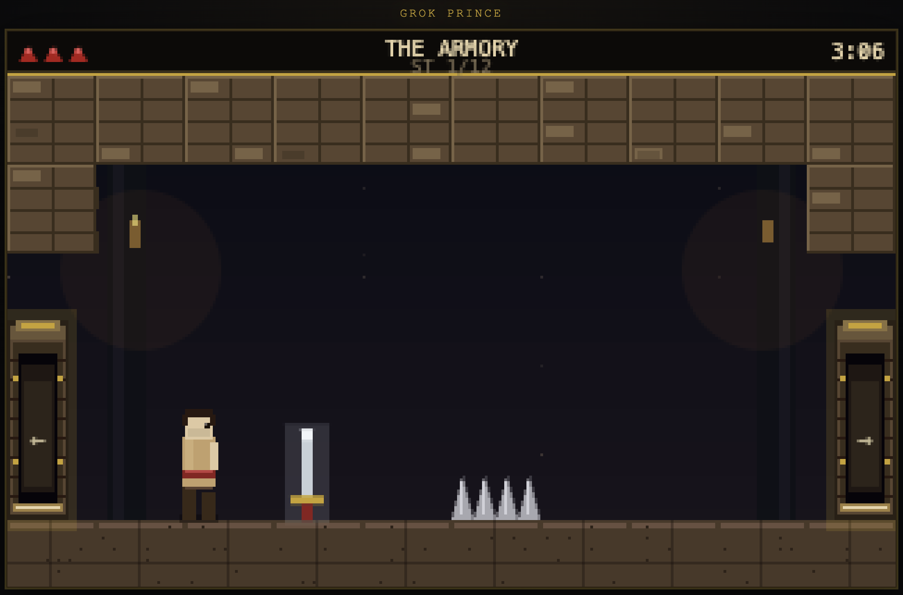

# Grok Prince

**Original** browser platformer — **12-stage campaign** from dungeon to neon streets, starship, and Mars.

Gameplay and atmosphere draw from several classics, not one franchise alone: **Castlevania**-style sword combat and chiptune tension, **Metroid** / Metroidvania room-to-room exploration, **Prince of Persia**–era careful platforming and timed sword duels, late-80s **cinematic platformers**, and other dungeon-adventure games of that era. All art, audio, levels, and code are original. This is **not** a remake, clone, or official product of any of those titles.

**Repo:** [github.com/LuisSanchez/grok-prince](https://github.com/LuisSanchez/grok-prince)



## Run

```bash
npm start
# open http://localhost:5173
```

Uses `server.mjs` (static files **+** leaderboard API). ES modules do **not** work via `file://`.

```bash
npm test
```

## Deploy on Vercel

```bash
npx vercel        # preview
npx vercel --prod # production
```

Project root is the site root. Serverless route: **`/api/leaderboard`**. Scores write to `data/leaderboard.json` (see [Leaderboard persistence](#leaderboard-persistence)).

For AI / agent context when extending the game, see **[AGENTS.md](./AGENTS.md)**.

## Controls

| Input | Action |
|-------|--------|
| ← → | Run / fight advance·retreat |
| ↑ | Jump (with dir = jump forward) |
| ↓ | Crouch / sheathe / ↓ hatch |
| Shift + dir | Careful step (stops at edges) |
| Space / Z | Strike (sword) |
| Shift | Parry (in combat) |
| Enter | Start / continue / confirm |
| P | Pause |
| R | Restart current stage (timer continues) |

Audio: **Music** / **FX** buttons under the canvas. `?debug=1` for hitboxes.

## Campaign (12 stages · 7:00 shared timer)

| # | Stage | Era | Notes |
|---|--------|-----|--------|
| 1–4 | Dungeon → Throne Approach | Castle | Sword, traps, guards |
| 5–8 | Neon Streets → Corporate Spire | Modern city | After castle→city time-warp |
| 9–10 | Hangar Bay → Bridge Core | Starship | After city→ship warp; teal crew enemies |
| 11–12 | Crash Site → Red Colony | Mars | After ship-fall cutscene; free princess |

**Mars:** enemies ≥ **7** HP; final boss **13** HP.

Vertical floors: stand on gold **↓** hatch and press **↓**. Side rooms: walk into wall doorways. Stage clear: walk into glowing **EXIT** door on the right.

## Leaderboard

Ranked by **clear time** (elapsed hourglass time — lower is better).

### What counts

Only a **full clean run**:

1. Press **Enter** on the title screen (start stage 1)
2. Finish **all 12 stages** before time runs out
3. **Do not use cheats**

### What voids ranking

| Cheat | Effect on leaderboard |
|-------|------------------------|
| `+` / `=` / numpad `+` (extra hearts) | **Disqualified** |
| `go1` … `go12` (jump stage) | **Disqualified** |
| `goera` / `goship` / `gomars` | **Disqualified** |

Deaths and **R** restart on the current stage are fine. Using cheats shows **NO RANK** / **CHEATS USED — NOT RANKED**.

On a clean victory you can **name your prince** and submit. Title screen shows top clears.

### API & storage

| Method | Path | Description |
|--------|------|-------------|
| `GET` | `/api/leaderboard?limit=10` | Top entries |
| `POST` | `/api/leaderboard` | Submit `{ name, elapsedSec, timeLeftSec, stages, eligible, cheated }` |

Data file: **`data/leaderboard.json`**

```json
{
  "version": 1,
  "updatedAt": "ISO-8601",
  "entries": [
    { "id": "…", "name": "PRINCE", "elapsedSec": 312.5, "timeLeftSec": 107.5, "stages": 12, "date": "…" }
  ]
}
```

### Leaderboard persistence

| Environment | Behavior |
|-------------|----------|
| Local `npm start` | Reads/writes `data/leaderboard.json` on disk |
| Vercel serverless | Same path API; **filesystem is ephemeral** — fine for demos; for durable prod scores later, replace `lib/leaderboardStore.js` with Blob/KV/DB |

## Cheats (QA / practice)

Type quickly (~1.5s, case-insensitive). **These void the leaderboard.**

| Code | Effect |
|------|--------|
| `go1` … `go12` | Jump to that stage (sword if stage ≥ 2) |
| `goera` | Castle→modern cutscene → stage 5 |
| `goship` | City→ship cutscene → stage 9 |
| `gomars` | Ship-falls-to-Mars cutscene → stage 11 |
| `+` / `=` / numpad `+` | +1 heart (max 5) |

## Design docs

- **[AGENTS.md](./AGENTS.md)** — full agent handbook (architecture, pitfalls, conventions)
- **[DESIGN.md](./DESIGN.md)** — early design notes (may lag implementation)

## Inspiration & legal

Grok Prince is **original software**. It is inspired by **several** classics (e.g. Castlevania, Metroid / Metroidvania structure, Prince of Persia–era cinematic platforming, late-80s dungeon-and-sword adventures)—not a remake of any one game. Not affiliated with or endorsed by the rights holders of those franchises.

## License

MIT (code). Graphics and audio are original for this project.
